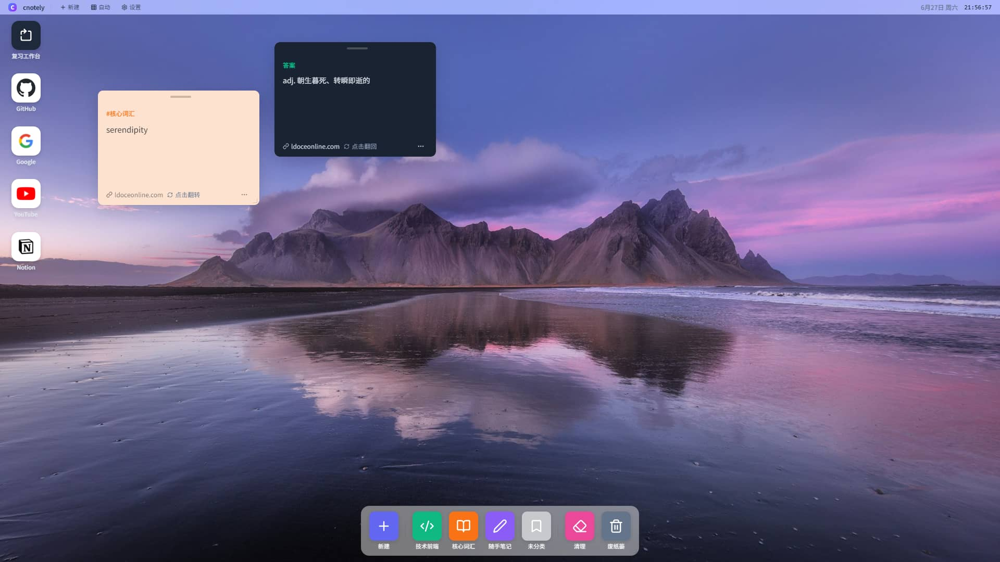
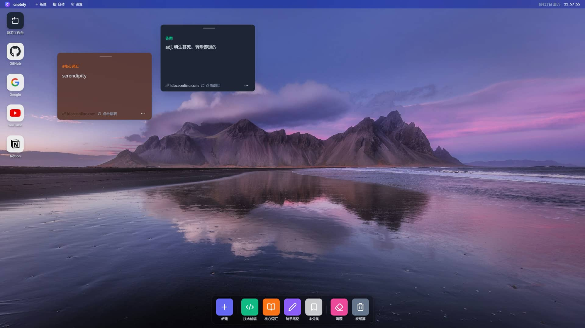
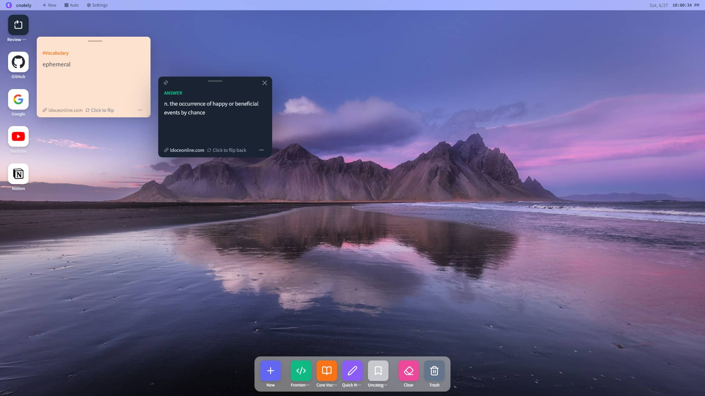
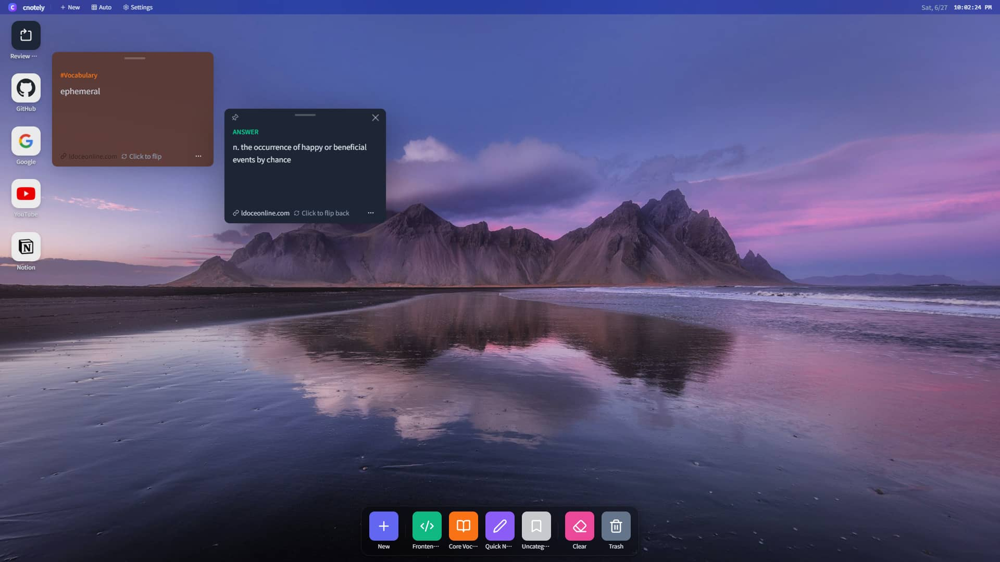

# cnotely

> 闪记便笺工作台 — 剪藏即制卡（Capture is Creation）

cnotely 是一个纯前端知识管理工具，把碎片化笔记与间隔重复闪卡无缝结合。它采用 macOS 桌面隐喻的交互设计 + Apple 风格磨砂玻璃 UI：在仿桌面环境中管理卡片、分类与链接，通过内置复习模式进行间隔重复记忆，再用番茄钟保持专注。所有数据存储在浏览器本地，无需后端服务。

## 截图

<p align="center">
  
  
</p>

<p align="center">
  
  
</p>

## 功能特性

### macOS 风格桌面工作台

- **桌面图标**：卡片 / 链接以 macOS 风格图标排列，支持「自动排列」与「自由排列」两种布局
- **Dock 栏**：底部 Dock 包含新建按钮、分类快捷入口、清空桌面、废纸篓
- **窗口系统**：卡片以 macOS 窗口打开，支持拖拽移动、调整大小、最小化、关闭、固定、最大化
- **右键菜单**：桌面图标和分类支持右键操作（打开、编辑名称 / 图标 / 颜色、移到废纸篓）
- **废纸篓**：删除的卡片进入废纸篓，支持恢复和彻底删除；可拖拽到 Dock 废纸篓区域删除
- **顶部菜单栏**：实时时钟、日期，集成新建、布局切换、设置入口

### 卡片系统

- **记忆卡（qa）**：问答式闪卡，正面问题、背面答案，支持 3D 翻转
- **文章卡（article）**：长文阅读笔记，Markdown 渲染 + PrismJS 代码高亮
- **分类管理**：卡片可归入不同分类，每个分类有独立颜色和图标，支持右键编辑
- **Markdown 编辑器**：分屏编辑 + 实时预览，工具栏支持常用 Markdown 语法与快捷键；正面亮色 / 背面暗色双主题面板
- **链接收藏**：链接类应用支持自动获取 favicon（网页图标 / 文字图标双模式）

### 复习模式

- **闪卡翻转复习**：3D 翻转动画，点击或空格键翻面
- **间隔重复算法**：基于艾宾浩斯遗忘曲线，标记「没记住」或「已掌握」自动计算下次复习时间
- **可调算法参数**：初始间隔、 ease factor、最小间隔倍数均可在设置中调整
- **键盘快捷键**：`Space` 翻面、`1` 没记住、`2` 已掌握
- **进度统计**：已刷数量、待复习剩余、按分类分组展示
- **全部重置**：支持一键重置所有卡片学习进度（需确认）
- **Session 快照机制**：复习过程中使用不可变快照防止卡片列表动态变化导致的迭代异常

### 番茄钟

- **专注循环**：专注 → 短休 → 专注 → … → 长休，长休周期可配置（默认 4 轮）
- **完成统计**：今日完成数、累计完成数、累计专注分钟数，跨日自动重置
- **提醒方式**：完成提示音（WebAudio 合成）+ 桌面通知（Notification API）
- **自动衔接**：可开启自动开始下一个阶段

### 设置系统

- **外观**：亮 / 暗主题、壁纸选择、自定义壁纸、磨砂模糊强度、菜单栏透明度、减弱动效
- **桌面**：布局模式、图标间距、是否显示图标标签、废纸篓直删
- **卡片**：默认卡片类型、翻转速度、3D 翻转开关、透视距离、卡片尺寸
- **复习**：复习主题、语言、间隔重复算法参数、自动下一张、显示艾宾浩斯曲线、乱序
- **番茄钟**：专注时长、短休时长、长休周期、长休时长、提示音、通知、自动开始

### 国际化

- 内置简体中文（zh-CN）与英文（en）双语
- 在 Chrome 扩展环境下自动与扩展语言同步

### 双运行环境

同一套代码可同时作为独立 Web 应用与 Chrome 扩展运行，存储适配器自动检测环境：

- **扩展环境**（`chrome-extension://`）→ `chrome.storage.local`
- **Web 环境**（`http://` / `https://` / `file://`）→ IndexedDB（Dexie）

### UI 设计体系

- **Apple 风格磨砂玻璃（Frosted Glass）**：全局统一的设计语言
  - 弹窗主体 `rgba(255,255,255,0.75)` + `backdrop-filter: blur(40px) saturate(180%)`
  - Header / Footer 半透明磨砂底色，与内容区融为一体
  - 所有子元素去 border 化，用半透明背景色区分层级
  - 圆角 16px、0.5px 极细分隔线、轻量级阴影
- **亮色 / 暗色双版本**：编辑器正面为亮色磨砂，背面为暗色磨砂
- **Teleport 下拉菜单**：分类选择器通过 Vue Teleport 渲染到 body 层级，不受弹窗 overflow 限制

## 技术栈

| 类别 | 技术 | 版本 | 说明 |
|------|------|------|------|
| 框架 | Vue 3 | ^3.5.13 | Composition API + `<script setup>` |
| 构建工具 | Vite | ^6.3.5 | 开发服务器 + HMR |
| 路由 | Vue Router | ^4.5.0 | SPA 路由管理，Hash 模式（兼容扩展与 file://） |
| CSS | Tailwind CSS | ^4.1.7 | 原子化 CSS，通过 `@tailwindcss/vite` 插件集成 |
| 本地数据库 | Dexie.js | ^4.4.2 | IndexedDB 封装，支持版本迁移（当前 v9） |
| Markdown 渲染 | Marked | ^18.0.3 | GFM 语法解析 |
| 代码高亮 | PrismJS | ^1.30.0 | 多语言语法高亮，tomorrow 主题 |
| 图标 | Lucide Vue Next | ^0.469.0 | Vue 3 原生图标组件 |

## 项目结构

```
card-app/
├── src/
│   ├── components/
│   │   ├── AppLauncher.vue        # 创建面板（链接/分类/记忆卡/文章卡）— 磨砂玻璃弹窗
│   │   ├── CardEditor.vue         # Markdown 分屏编辑器 — 亮色/暗色双版磨砂玻璃
│   │   ├── CardWindowContent.vue  # 卡片窗口内容（翻转/Markdown 渲染）
│   │   ├── ContextMenu.vue        # 右键上下文菜单
│   │   ├── DesktopIcon.vue        # 桌面图标（拖拽排序）
│   │   ├── Settings.vue           # 设置面板（外观/桌面/卡片/复习/番茄钟）
│   │   └── WindowFrame.vue        # macOS 风格窗口框架
│   ├── composables/
│   │   ├── useCardStore.js        # 核心状态管理 + 艾宾浩斯间隔重复算法
│   │   ├── usePomodoro.js         # 番茄钟（专注/休息循环 + 统计）
│   │   ├── useSettings.js         # 全局设置（持久化 + 主题应用）
│   │   ├── useSheetWindow.js      # 弹窗窗口管理（拖拽/层级/最大化）
│   │   └── useZIndex.js           # 窗口 z-index 管理
│   ├── db/
│   │   └── index.js               # Dexie 数据库定义 + 种子数据（v1 → v9 迁移）
│   ├── locales/
│   │   ├── i18n.js                # 轻量 i18n（$t 插值 + 语言持久化）
│   │   ├── zh-CN/                 # 简体中文文案
│   │   └── en/                    # 英文文案
│   ├── router/
│   │   └── index.js               # Hash 路由配置（桌面 / 复习）
│   ├── storage/
│   │   ├── adapter.js             # 存储适配器（自动检测扩展/Web 环境）
│   │   └── providers/
│   │       ├── chrome-storage.js  # chrome.storage.local provider
│   │       └── indexeddb.js       # IndexedDB (Dexie) provider
│   ├── utils/
│   │   └── analytics-sdk.js       # 匿名事件统计 SDK
│   ├── views/
│   │   ├── DesktopView.vue        # 桌面主视图（含废纸篓/分类编辑弹窗）
│   │   └── ReviewView.vue         # 复习视图
│   ├── App.vue
│   ├── main.js
│   └── style.css                  # 全局样式（Tailwind + 自定义 CSS）
├── docs/
│   └── screenshots/               # README 截图
├── public/                        # 静态资源（logo / manifest）
├── index.html
├── package.json
├── vite.config.js
└── wrangler.jsonc                 # Cloudflare Pages 部署配置
```

## 快速开始

```bash
cd card-app
npm install
npm run dev
```

## 可用命令

| 命令 | 说明 |
|------|------|
| `npm run dev` | 启动 Vite 开发服务器（HMR 热更新） |
| `npm run build` | 生产构建，输出到 `dist/` |
| `npm run preview` | 预览生产构建结果 |

## 部署

项目内置 Cloudflare Pages 部署配置（`wrangler.jsonc`，SPA 模式）：

```bash
npm run build
npx wrangler pages deploy dist --name cnotely-card
```

也可将 `dist/` 上传至任意静态托管服务（Vercel / Netlify / GitHub Pages 等）。由于使用 Hash 路由，无需额外配置 SPA 回退规则。

## 架构说明

- **状态管理**：采用自定义 composable（`useCardStore` / `usePomodoro` / `useSettings`）实现全局单例状态管理，未使用 Pinia / Vuex
- **数据持久化**：所有数据存储在浏览器本地，通过 Dexie.js 管理，支持 v1 → v9 共 9 个版本的自动迁移
- **存储适配**：`storage/adapter.js` 在启动时探测运行环境，扩展模式路由到 `chrome.storage.local`，Web 模式路由到 IndexedDB，二者接口与 Dexie `db.settings` 完全兼容
- **路由**：使用 Hash 模式以保证在 `file://`、Chrome 扩展及静态托管环境下均可正常工作
- **纯前端**：无后端依赖，数据完全本地化；统计 SDK 为可选匿名上报
- **UI 组件**：核心弹窗组件均采用自定义语义化 CSS class（scoped），不依赖 Tailwind 内联类，确保磨砂玻璃效果一致性

## License

本项目即将开源，许可证待补充（建议 MIT）。
